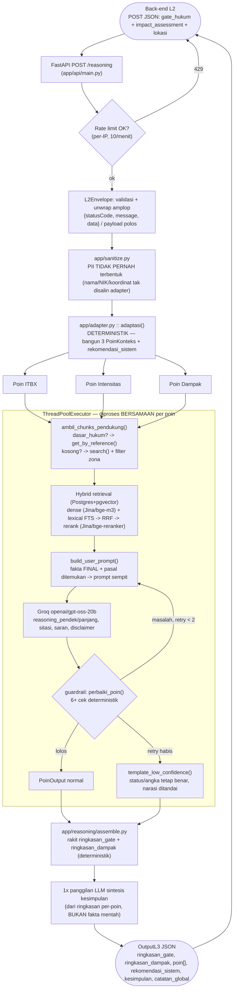
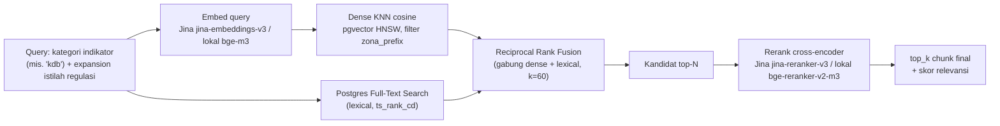

# 🏛️ RDTR Sleman — AI Reasoning (L3 Advisory)


Komponen **AI Reasoning** untuk pre-check risiko izin bangunan (KKPR/PBG) di Kabupaten Sleman.
Sistem menerima hasil pemeriksaan hukum & dampak tata ruang dari back-end (**L2 Spatial Risk
Assessment**), mengambil pasal/lampiran regulasi RDTR yang relevan lewat **RAG hybrid**
(dense + lexical), lalu menghasilkan **reasoning berbahasa Indonesia, sitasi pasal terverifikasi,
target numerik pasti, dan rekomendasi** — sebagai JSON siap-render untuk reviewer (petugas Pemda).

> **Prinsip inti — neuro-simbolik, bukan "tanya LLM apa saja":** semua angka, status, dan verdict
> **selalu** berasal dari kode deterministik (kalkulator + fakta back-end), **tidak pernah** dari
> LLM. LLM hanya diberi skema sempit untuk membungkus fakta itu jadi narasi — dan setiap keluaran
> LLM divalidasi ulang oleh guardrail sebelum dikirim. Lihat [§ Cara Kerja](#-cara-kerja-sistem).

---

## 📌 Ringkasan

| | |
|---|---|
| **Input** | JSON dari back-end L2 (`gate_hukum` + `impact_assessment` + `lokasi`) |
| **Output** | JSON terstruktur (`OutputL3`) — ringkasan, 3 poin reasoning+sitasi+rekomendasi, kesimpulan |
| **Endpoint** | `POST /reasoning` (+ `GET /health`), FastAPI, lihat Swagger di `/docs` |
| **LLM** | Groq `openai/gpt-oss-20b` — **hanya** merangkai narasi, tidak pernah memutuskan angka/status |
| **Retrieval** | Hybrid RAG (Postgres + pgvector): dense + lexical (FTS, tsquery ber-OR atas query asli) → Reciprocal Rank Fusion → rerank |
| **Embedding/Reranker** | **Jina AI** (`jina-embeddings-v3` / `jina-reranker-v3`, default produksi) atau **lokal** (`BAAI/bge-m3` / `bge-reranker-v2-m3`) — pilih via `.env`, nol perubahan kode |
| **Guardrail** | 6+ cek deterministik (konsistensi angka/verdict/sitasi) + retry terarah + fallback aman |

---

## 🧠 Cara Kerja Sistem

Setiap permohonan dinilai atas **3 poin independen** — diproses **paralel** (`ThreadPoolExecutor`):

| Poin | Yang dinilai | Tipe rekomendasi | Sumber angka/target |
|---|---|---|---|
| **ITBX** | Klasifikasi kegiatan (Izin/Terbatas/Bersyarat/Dilarang) vs Matriks Zonasi | kategorikal | Matriks ITBX (back-end) |
| **Intensitas** | KDB/KLB/KDH usulan vs ambang RDTR | numerik | `calculator.py::hitung_target_intensitas` |
| **Dampak** | Kategori dampak tata guna lahan (limpasan air/runoff) | numerik-mitigasi | `calculator.py::hitung_target_mitigasi_dampak` |

Untuk **setiap poin**, alurnya:

1. **Ambil dasar hukum** — kalau back-end sudah kasih rujukan pasal spesifik (`dasar_hukum`), ambil
   presisi lewat `get_by_reference()`. Kalau tidak ada, **retrieval RAG** (`search()`) dengan query
   kategori indikator + **filter keluarga zona** (mis. "Zona Perumahan" → hanya kode `R-*`, cegah
   Lampiran zona lain ikut terkutip).
2. **Bangun prompt sempit** — fakta (status/angka/target, SUDAH final dari kode) + pasal yang
   ditemukan dirangkai jadi prompt. LLM **tidak** diberi data mentah permohonan (nama/NIK/koordinat
   presisi disaring `app/sanitize.py` sebelum ini — lihat [§ Keamanan Data](#-keamanan--privasi-data)).
3. **Panggil LLM** (Groq, `temperature=0` percobaan pertama) — hasilkan `reasoning_pendek`,
   `reasoning_panjang`, `sitasi[]`, `saran`, `disclaimer` (JSON schema-constrained). Di luar LLM,
   `rekomendasi.langkah_konkret[]` (additive, 2026-08-18) dirakit **deterministik** langsung dari
   `app/reasoning/calculator.py` — daftar SEMUA parameter yang melanggar sekaligus (mis. KDB & KDH
   berbarengan) dgn `{parameter, deskripsi, nilai_saat_ini, nilai_target, satuan}` per item; beda
   dari `target` (satu angka representatif saja). Checklist presisi yang tak bergantung pada narasi
   LLM manapun yang sedang dipakai.
4. **Guardrail memvalidasi** — 6+ cek deterministik: sitasi harus ada di daftar yang diberikan
   (bukan karangan), angka di narasi harus terlacak ke fakta sumber, verdict tidak boleh
   kontradiktif, skor dampak (invers) tidak boleh disalahtafsirkan, dst. Gagal → **retry** dengan
   catatan perbaikan spesifik (maks 2x). Retry habis → **fallback template** eksplisit
   (`low_confidence=true`, status/angka tetap benar dari kode — cuma narasi yang ditandai perlu
   tinjauan manual). **Satu poin gagal tidak pernah menjatuhkan permohonan lain** — endpoint tetap
   200 dengan poin lain normal.
5. **Rakit hasil** — semua poin selesai → ringkasan gate & dampak dirakit deterministik, kesimpulan
   disintesis LLM (1 panggilan, dari ringkasan per-poin yang sudah lolos guardrail, bukan fakta
   mentah) → `OutputL3` JSON.

### Diagram Alur — Input JSON → Output JSON



### Zoom-in: Retrieval Hybrid (per poin, saat perlu `search()`)



Provider embedding/rerank **dipilih via `.env`** (`EMBEDDING_PROVIDER`/`RERANK_PROVIDER=jina|local`)
— tanpa ubah kode. Setiap panggilan ke provider eksternal (Jina) melewati transport dengan
**retry+timeout+circuit-breaker+semaphore concurrency** (`app/retrieval/_provider_http.py`), dan
hasil retrieval+rerank final **di-cache in-memory** (`app/retrieval/cache.py`, kunci kategori+zona+
dokumen+provider) untuk memangkas panggilan API berulang pada query yang repetitif antar-permohonan.

---

## 🛡️ Keamanan & Privasi Data

`app/sanitize.py` adalah **pagar eksplisit**, bukan asumsi — dipanggil nyata di titik pembentukan
query retrieval (`retriever.search()`/`get_by_reference()`) dan prompt LLM (`build_user_prompt()`):

- **Allowlist eksplisit** field apa saja yang boleh masuk fakta LLM per poin (kategori, zona, angka
  target, dasar hukum) — field yang tak terdaftar **otomatis dibuang**, bukan lolos-karena-lupa.
  Field terlarang (nama pemohon, NIK, koordinat presisi, `application_number`) tak pernah ada di
  daftar itu sejak awal.
- **Scrub pola PII** (regex: NIK, nomor telepon, email, koordinat, nomor aplikasi) pada field
  bebas-teks yang memang sah dikirim (mis. `itbx.reason`, `keterangan_ketentuan` — ditulis petugas,
  berpotensi memuat catatan personal tanpa sengaja).
- **Fail-safe teruji**: kalau pola PII kebetulan lolos ke query retrieval, `sanitize_query_text()`
  **menolak keras** (raise) sebelum request keluar — diisolasi per-poin oleh guardrail/assemble
  (satu poin jatuh ke `low_confidence`, permohonan lain tetap normal, endpoint tetap 200 — dites
  eksplisit, bukan diasumsikan).

---

## 🤖 Model & Provider

| Komponen | Default produksi | Alternatif (rollback) | Catatan |
|---|---|---|---|
| **LLM** | `openai/gpt-oss-20b` (Groq) | `openai/gpt-oss-120b` (Groq) | JSON schema-constrained, `temperature=0`. Ganti dari `llama-3.3-70b-versatile` 2026-08-15 (decommissioned Groq per 2026-08-16), dipilih via `eval/bakeoff.py` — lihat `docs/STATUS.md` § Keputusan model |
| **Embedding** | `jina-embeddings-v3` (1024-dim) | `BAAI/bge-m3` (lokal, `transformers`) | `EMBEDDING_PROVIDER=jina\|local` |
| **Reranker** | `jina-reranker-v3` | `BAAI/bge-reranker-v2-m3` (lokal) | `RERANK_PROVIDER=jina\|local` |
| **Vector DB** | Postgres 16 + `pgvector` (HNSW cosine) | — | Docker Compose, dev lokal |
| **Document Parser** | LlamaParse (mode `agentic`) | Docling (lokal) | Sekali jalan saat ingest, bukan runtime |

**Kenapa Jina jadi default (Agustus 2026):** VPS produksi tak cukup memori untuk `transformers`+
`torch` (~2–3GB). Retrieval gate eval (22 query, Sleman Tengah) membuktikan Jina **setara** bge-m3
lokal (Hit-Rate@5 100% keduanya; MRR 0.875 vs 0.936 — di atas ambang ≥0.60), dan smoke test live
menunjukkan faithfulness/grounding konsisten. bge-m3 lokal **dipertahankan penuh** sebagai jalur
rollback (`EMBEDDING_PROVIDER=local`/`RERANK_PROVIDER=local`, nol perubahan kode). Rincian angka,
metodologi eval, dan keputusan lengkap: **[`docs/STATUS_RAG.md`](docs/STATUS_RAG.md)**.

> ⚠️ Cakupan data saat ini: vektor Jina baru terisi penuh untuk **RDTR Sleman Tengah**. Timur/Barat
> belum di-re-embed ke Jina (lihat `docs/HANDOFF_RAG_MIGRASI_JINA.md`).

---

## 📥 Kontrak Input / 📤 Output

**Input** (`POST /reasoning`, model `L2Envelope` — terima payload polos ATAU ber-amplop
`{statusCode, message, data}`):

```jsonc
{
  "lokasi": { "koordinat": {"lat": -7.78, "lon": 110.48}, "rdtr_zone": "Zona Perumahan", "luas_lahan_m2": 1000 },
  "gate_hukum": {
    "final_gate_status": "Lolos Bersyarat",
    "decisive_stage": "intensitas",
    "tahapan": {
      "itbx": { "status": "T", "lolos": true, "kbli_diusulkan": "0111", "reason": "...", "dasar_hukum": [] },
      "intensitas": { "status": "MELAMPAUI_BATAS", "lolos": false, "parameter": { "kdb": {"usulan": 90, "ambang_maks": 60, "memenuhi": false, "satuan": "persen"} } }
    }
  },
  "impact_assessment": { "dinilai": true, "impact_category": "Tinggi", "runoff_change_index": 2.85, "threshold_bands": {"Sedang": "1.5-2.5", "Tinggi": "2.5-4.0"} }
}
```

**Output** (`OutputL3`) — ringkasan_gate, ringkasan_dampak, `poin[]` (reasoning + sitasi
terverifikasi + rekomendasi bertarget angka pasti bila relevan), `rekomendasi_sistem`, kesimpulan,
`catatan_global`, `low_confidence_keseluruhan`. Skema lengkap: `app/schemas.py::OutputL3`, atau
langsung lihat `openapi.json` / Swagger `/docs`.

---

## 💻 Tech Stack

| Layer | Teknologi |
|---|---|
| API | FastAPI + Uvicorn |
| Validasi | Pydantic v2 |
| LLM client | OpenAI SDK (kompatibel Groq, `LLM_BASE_URL` dapat diganti) |
| Retrieval | `psycopg` + `pgvector`, Postgres 16 (Docker) |
| Embedding/Rerank lokal | `transformers` + `torch` (langsung, **bukan** `sentence-transformers` — crash `datasets`→`pyarrow` di Windows) |
| Embedding/Rerank serverless | `httpx` → Jina AI REST API |
| Observability | Langfuse (opsional, no-op tanpa konfigurasi) |
| Testing | `pytest` (offline + `@pytest.mark.live`) |

---

## 📂 Struktur Proyek

```text
app/
├── api/            FastAPI: main.py (routes), dependencies.py (DI retriever), rate_limit.py
├── adapter.py       L2Assessment -> 3 PoinKonteks (deterministik, TANPA LLM/RAG)
├── sanitize.py       Pagar PII eksplisit (query retrieval & prompt LLM)
├── schemas.py         Kontrak Pydantic input/output
├── reasoning/
│   ├── calculator.py   Target numerik (KDB/KLB/KDH, mitigasi dampak) — murni aritmatika fakta
│   ├── generator.py    generate_poin(): retrieval + prompt + panggil LLM
│   ├── guardrail.py    Validasi & retry & fallback low_confidence
│   ├── prompts.py       SYSTEM_PROMPT + builder prompt per poin
│   ├── assemble.py       jalankan_precheck(): orkestrasi paralel + rakit OutputL3
│   ├── llm_client.py     Transport LLM tipis (provider via .env)
│   └── rekomendasi.py    Turunkan rekomendasi_sistem dari gate+dampak
└── retrieval/
    ├── retriever.py       RetrieverAsli: hybrid search + get_by_reference + get_parent
    ├── embeddings.py       Provider embedding (jina|local)
    ├── rerank.py            Provider reranker (jina|local)
    ├── _provider_http.py     Transport bersama: retry+timeout+circuit-breaker+semaphore
    ├── cache.py               Cache in-memory hasil retrieval+rerank
    ├── db.py                    Query Postgres (dense/lexical/lookup)
    └── mock.py                   MockRetriever (dev/testing, tanpa DB)
sql/schema.sql        Skema Postgres+pgvector
scripts/               Tooling operasional (ingest, reembed, health-check, dsb.)
tests/                 pytest — offline (default) + live (@pytest.mark.live)
docs/                  Status, integrasi, keputusan desain (lihat § Dokumentasi)
```

---

## 🚀 Menjalankan

**1. Siapkan database** (Postgres+pgvector via Docker):
```bash
docker compose up -d
docker compose ps   # tunggu STATUS = healthy
```

**2. Install dependencies** (pilih sesuai kebutuhan):
```bash
pip install -e .                    # inti (API + reasoning)
pip install -e ".[rag-serverless]"  # + retrieval (Jina, ringan — TANPA torch)
# ATAU, kalau mau jalur lokal (bge-m3/bge-reranker, butuh ~2-3GB lebih):
pip install -e ".[rag]"
```

**3. Konfigurasi**: salin `.env.example` → `.env`, isi `GROQ_API_KEY` (+ `JINA_API_KEY` kalau pakai
provider default).

**4. Ingest korpus regulasi** (sekali, per wilayah — lihat `docs/STATUS_RAG.md` untuk detail penuh):
```bash
python -m app.ingest.parse --backend llamaparse --input data/raw --out data/parsed/v1
python -m app.ingest.ingest --structured data/parsed/v1/structured --version v1
```

**5. Jalankan server**:
```bash
python -m uvicorn app.api.main:app --reload --port 8000
```
Buka **Swagger UI**: `http://localhost:8000/docs` — coba `POST /reasoning` langsung dari sana
(payload contoh ada di `tests/fixtures/*.json`).

---

## 🧪 Testing

```bash
pytest -q -m "not live"   # offline — mock retriever, tanpa panggilan API eksternal
pytest -q -m "live"       # butuh GROQ_API_KEY / JINA_API_KEY — panggilan sungguhan
```

Tool operasional tambahan: `python -m scripts.check_provider_health` (sanity + stress-test
concurrency provider embedding/rerank aktif — jalankan manual kapan pun perlu re-verifikasi).

---

## 📚 Dokumentasi Lanjutan

| Dokumen | Isi |
|---|---|
| [`docs/STATUS.md`](docs/STATUS.md) | Status komponen reasoning, hasil eval gold-set, hardening |
| [`docs/STATUS_RAG.md`](docs/STATUS_RAG.md) | Status retrieval, keputusan provider Jina, cakupan korpus |
| [`docs/HANDOFF_RAG_MIGRASI_JINA.md`](docs/HANDOFF_RAG_MIGRASI_JINA.md) | Ringkasan alih-sesi migrasi Jina — status akhir, keterbatasan diketahui |
| [`docs/INTEGRASI_BACKEND.md`](docs/INTEGRASI_BACKEND.md) | Kontrak dgn tim back-end (L2 payload) |
| [`docs/INTEGRASI_RETRIEVER.md`](docs/INTEGRASI_RETRIEVER.md) | Kontrak SEAM `Retriever` Protocol |
| `.env.example` | Sumber kebenaran konfigurasi (env var lengkap & terkini) |

---

## 📜 License

MIT License — lihat [`LICENSE`](LICENSE).

## 👤 Author

**Farhan Ahmad Naufal** — [@farhanahmadn](https://github.com/farhanahmadn)
