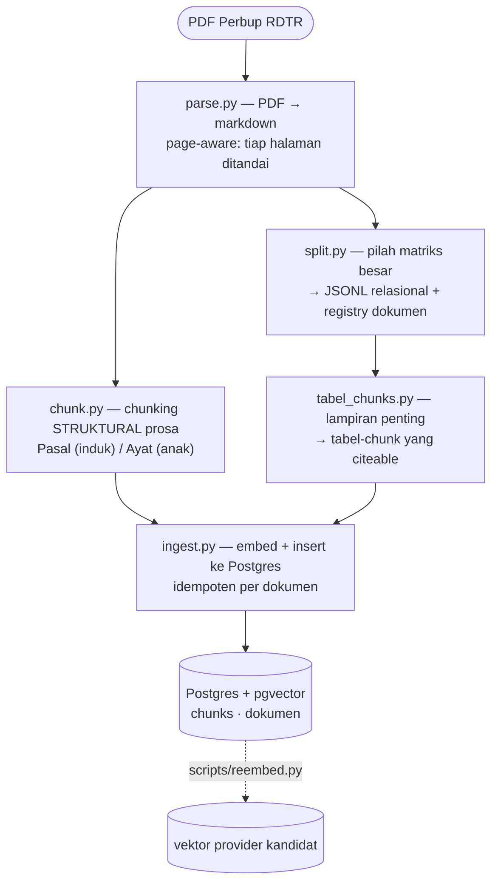
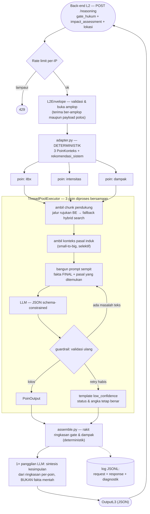
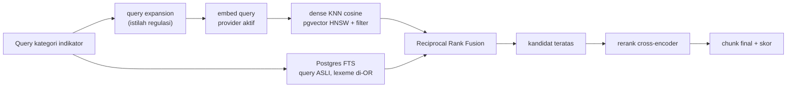

# Arsitektur Sistem RAG / AI Reasoning — RDTR Sleman

Dokumen ini menjelaskan **arsitektur inti**: stack yang dipakai, pembagian modul, dan alur sistem
dari dokumen mentah sampai JSON jawaban. Sengaja **tidak memuat angka/ambang konkret** (nilai `k`,
timeout, batas retry, ambang eval, dst) — itu berubah lebih cepat daripada arsitekturnya dan sudah
punya sumber kebenaran sendiri:

| Butuh apa | Lihat di mana |
|---|---|
| Nilai konfigurasi & env var terkini | `.env.example` (sumber kebenaran) |
| Angka eval, keputusan provider/model, status per komponen | `docs/STATUS_07_09_26.md`, `docs/STATUS_RAG.md` |
| Kontrak payload dengan back-end | `docs/INTEGRASI_BACKEND.md` |
| Kontrak SEAM retriever | `docs/INTEGRASI_RETRIEVER.md` |

---

## 1. Prinsip inti: neuro-simbolik

Satu keputusan ini menjelaskan hampir semua bentuk arsitektur di bawahnya.

> **Semua angka, status, dan verdict berasal dari kode deterministik** (kalkulator + fakta back-end
> apa adanya). **LLM hanya membungkus fakta itu menjadi narasi Bahasa Indonesia** dalam skema JSON
> yang sempit. Setiap keluaran LLM divalidasi ulang oleh guardrail sebelum dikirim.

Konsekuensi yang tampak di seluruh kode:

- LLM **tidak pernah** diberi kewenangan menghitung, menyimpulkan status, atau memutuskan verdict.
- Kalau LLM gagal berulang kali, sistem jatuh ke template deterministik dengan penanda
  `low_confidence` — **status dan angkanya tetap benar**, hanya narasinya yang ditandai perlu
  tinjauan manual. Sistem tidak pernah crash karena LLM.
- Fakta back-end **tidak pernah dikoreksi** oleh sistem ini (prinsip *faithful*). Kalau data
  back-end terlihat tidak konsisten, sistem **menandainya**, bukan memperbaikinya.
- Kegagalan diisolasi **per poin**: satu poin jatuh tidak menjatuhkan permohonan.

Sistem ini adalah **L3 Advisory** — lapis penjelas di atas keputusan yang sudah dibuat back-end
(**L2 Spatial Risk Assessment**). Pembacanya petugas Pemda, bukan warga.

---

## 2. Stack

| Lapis | Teknologi |
|---|---|
| API | FastAPI + Uvicorn |
| Validasi kontrak | Pydantic v2 |
| LLM | OpenAI-compatible SDK → Groq (model & base URL via env) |
| Vector DB | PostgreSQL + `pgvector` (indeks HNSW, jarak cosine) |
| Lexical search | PostgreSQL Full-Text Search (`tsvector` + GIN) |
| Embedding & rerank | **Provider-agnostic**: Jina AI (serverless) atau bge-m3/bge-reranker (lokal, `transformers`) |
| Parser dokumen | LlamaParse (cloud) atau Docling (lokal) — hanya saat ingest |
| Observability | Langfuse (opsional, no-op tanpa konfigurasi) |
| Testing | `pytest` — suite offline (mock, tanpa DB/API key) + uji `live` bertanda |
| Deploy | GitHub Actions → rsync + PM2 di VPS; Postgres via container |

Dua catatan arsitektural tentang stack:

- **Dependensi berat dipisah sebagai extra.** Inti (`pip install -e .`) hanya API + reasoning.
  Retrieval serverless menambah `psycopg`/`httpx` saja; jalur lokal (`transformers`+`torch`) adalah
  extra terpisah. Seluruh impor berat bersifat *lazy* di dalam fungsi, sehingga suite offline dan
  proses produksi tidak pernah memuat torch kalau tidak dipakai.
- **Provider bisa ditukar tanpa mengubah kode.** LLM, embedding, dan reranker semuanya dipilih lewat
  env var. Jalur lokal dipertahankan penuh sebagai rollback/self-host, bukan dihapus.

---

## 3. Peta modul

```text
app/
├── api/
│   ├── main.py            Endpoint HTTP — transport murni, tanpa logika reasoning
│   ├── dependencies.py    DI retriever (asli/mock) via Depends()
│   ├── rate_limit.py      Pembatas laju per-IP untuk /reasoning
│   └── admin.py           Endpoint operasional (invalidasi cache), fail-closed
├── schemas.py             Kontrak Pydantic: L2Envelope/L2Assessment (masuk), OutputL3 (keluar)
├── adapter.py             L2Assessment → 3 PoinKonteks + rekomendasi_sistem (deterministik)
├── sanitize.py            Pagar PII eksplisit sebelum teks keluar (retrieval & prompt)
├── logging_util.py        Log JSONL request+response+diagnostik
├── reasoning/
│   ├── calculator.py      Semua aritmatika: target intensitas, target/langkah mitigasi
│   ├── prompts.py         SYSTEM_PROMPT + perakit prompt per poin & prompt kesimpulan
│   ├── generator.py       Retrieval → prompt → LLM → rakit PoinOutput
│   ├── guardrail.py       Validasi ulang, retry terarah, paksaan deterministik, fallback, diagnosa
│   ├── templates.py       Template tanpa LLM (poin aman) & fallback low_confidence
│   ├── assemble.py        Orkestrasi paralel 3 poin + rakit OutputL3
│   ├── llm_client.py      Transport LLM tipis + rotasi multi-API-key
│   ├── rekomendasi.py     Turunkan rekomendasi_sistem dari gate + kategori dampak
│   └── observability.py   Wrapper Langfuse (no-op tanpa env)
├── retrieval/
│   ├── base.py            Protocol `Retriever` + `Chunk`/`RetrievalFilters` — kontrak SEAM
│   ├── retriever.py       Implementasi asli: hybrid search, get_by_reference, get_parent
│   ├── db.py              Akses Postgres: dense KNN, FTS, lookup rujukan, parent
│   ├── fusion.py          Reciprocal Rank Fusion
│   ├── embeddings.py      Dispatch embedding per provider (satu sumber kebenaran)
│   ├── rerank.py          Dispatch reranker per provider
│   ├── _provider_http.py  Transport HTTP bersama: retry, timeout, circuit breaker, semaphore
│   ├── cache.py           Cache in-memory ber-TTL untuk hasil retrieval final
│   └── mock.py            MockRetriever — dev/test tanpa DB
└── ingest/                Pipeline offline: parse → split → chunk → tabel_chunks → ingest
```

---

## 4. Alur A — Ingest (offline, sekali per dokumen)

Pipeline ini **tidak berjalan saat melayani permintaan**. Ia mengubah PDF peraturan menjadi chunk
yang bisa diretrieve dan disitasi.



Keputusan penting di tahap ini:

**Page-aware sejak parse.** Nomor halaman adalah syarat sitasi, jadi penanda halaman disuntikkan ke
markdown agar chunker bisa menautkan halaman yang akurat ke setiap chunk.

**Chunking struktural, bukan semantik.** Segmentasi mengikuti struktur hukum dokumen (Pasal → Ayat),
bukan kemiripan makna. Alasannya: satuan sitasi dalam hukum Indonesia adalah pasal/ayat, dan `id`
chunk dipakai langsung sebagai `citation_id`. Karena itu id dibuat **stabil dan deterministik** dari
nomor pasal/ayat.

**Hierarki parent–child (small-to-big).**

| Level | Peran | Di-embed? |
|---|---|---|
| `pasal` (punya anak ayat) | Konteks penuh untuk ekspansi | **Tidak** — disimpan saja, agar tidak duplikat hit dengan anaknya |
| `pasal` (tanpa ayat) | Dia sendiri daunnya | Ya |
| `ayat` | Unit utama yang diretrieve & disitasi | Ya |
| `tabel` | Lampiran yang perlu bisa disitasi | Ya |

Daftar definisi (Ketentuan Umum) diperlakukan khusus: setiap butir definisi menjadi satu chunk
sendiri, karena masing-masing memang berdiri sendiri sebagai rujukan.

**Granularitas berhenti di ayat.** Huruf a/b/c tetap di dalam chunk ayat, tidak dipecah lebih jauh —
huruf dikutip sebagai bagian dari ayat ("Pasal … ayat (2) huruf a"), bukan sebagai rujukan mandiri.

**Prefiks kontekstual saat embedding.** Yang di-embed bukan teks mentah chunk, melainkan teks yang
sudah diberi prefiks identitas (`[dokumen | Pasal … ayat …]`). Chunk pendek jadi punya jangkar
konteks di ruang vektor.

**Matriks besar tidak di-embed.** Matriks kegiatan-per-zona dan tabel intensitas-per-zona adalah data
relasional otoritatif untuk rule engine, terlalu granular untuk retrieval semantik. Yang dibuat
citeable adalah ringkasan lampirannya sebagai tabel-chunk.

> **Catatan kondisi saat ini:** dua tabel relasional (`matriks_kegiatan`, `intensitas_zona`)
> terdefinisi di skema dan file JSONL-nya dihasilkan `split.py`, tetapi **tidak ada kode yang
> memuatnya ke DB** — jembatan file→DB belum ditulis. Runtime tidak menyentuh keduanya, jadi ini
> tidak memutus layanan. Tabel yang benar-benar dipakai runtime ada tiga: `chunks`, `dokumen`, dan
> tabel vektor provider aktif.

---

## 5. Alur B — Runtime (per permohonan)



### 5.1 Tiga poin yang dinilai

| Poin | Yang dijelaskan | Tipe rekomendasi | Sumber angka/status |
|---|---|---|---|
| `itbx` | Klasifikasi kegiatan (Izin/Terbatas/Bersyarat/Dilarang) vs matriks zonasi | kategorikal | matriks back-end |
| `intensitas` | KDB/KLB/KDH usulan vs ambang zona | numerik | `calculator.py` |
| `dampak` | Dampak hidrologi / limpasan tata guna lahan | numerik-mitigasi | back-end + `calculator.py` |

Ketiganya berbagi satu mesin yang sama — tidak ada cabang kode khusus per poin di luar perakitan
fakta di `adapter.py` dan pemilihan template kalimat.

### 5.2 Retrieval per poin

Dua jalur, dengan urutan prioritas:

1. **Jalur rujukan (utama).** Kalau back-end menyebut dasar hukum spesifik, chunk diambil presisi
   lewat lookup rujukan — bukan pencarian semantik. Hasilnya **diurutkan dan disaring menurut
   kecocokan zona pemohon** (sub-zona persis → satu keluarga zona → chunk tak terikat zona), dan
   chunk milik keluarga zona lain dibuang. Rujukan generik yang cocok ke banyak dokumen dipecah
   serinya memakai wilayah yang dilayani.
2. **Jalur pencarian (fallback).** Kalau jalur rujukan tidak menghasilkan apa pun, dijalankan hybrid
   search dengan kata kunci kategori indikator + filter zona (persis bila sub-zona diketahui, filter
   keluarga zona bila tidak).

Alasan urutan ini: rujukan dari back-end adalah dasar hukum yang benar-benar dipakai saat mengambil
keputusan, jadi lebih otoritatif daripada apa pun yang ditemukan pencarian semantik.

### 5.3 Pipeline hybrid search



Dua detail yang mudah salah dan sengaja dibedakan:

- **Sisi dense memakai query yang diperluas; sisi lexical memakai query asli.** Expansion membantu
  pencocokan semantik, tetapi merusak FTS — memperpanjang query sambil meng-AND-kan lexeme membuat
  hampir tidak ada chunk yang cocok. Karena itu lexeme query di-OR-kan dan expansion tidak dipakai
  di sisi ini.
- **Query dan chunk wajib di-embed oleh model yang sama.** Ruang vektor dua model berbeda tidak
  sepadan, jadi vektor tiap provider disimpan di tabelnya sendiri dan jalur query membaca tabel yang
  cocok dengan provider aktif.

**Filter** yang tersedia: wilayah/dokumen, sub-zona persis, keluarga zona, jenis, dan tanggal
berlaku. Filter wilayah mencegah pasal dari RDTR kawasan lain ikut tersitasi.

**Cache.** Hasil retrieval+rerank final di-cache in-memory ber-TTL, dengan kunci yang menyertakan
provider aktif — supaya mengganti provider tidak menyajikan hasil provider lama. Ruang query sistem
ini kecil dan repetitif (kategori indikator × zona × wilayah), jadi cache memangkas panggilan API
berbayar secara signifikan. Cache bersifat per-proses; karena skrip ingest berjalan sebagai proses
terpisah, invalidasi dilakukan lewat endpoint admin, bukan panggilan fungsi.

### 5.4 Ekspansi konteks (small-to-big)

Chunk ayat sering merujuk bagian lain ("sebagaimana dimaksud pada ayat …"), sehingga tidak bermakna
kalau berdiri sendiri. Karena itu teks **pasal induk** dilampirkan ke prompt sebagai **konteks baca,
bukan kandidat sitasi baru** — sitasi tetap menunjuk `citation_id` ayat yang presisi.

Ekspansi ini **selektif**, bukan menyeluruh: hanya untuk chunk teratas, hanya untuk ayat yang memang
memuat rujukan silang, dan teks induk dipotong pada batas tertentu. Tanpa penyaringan itu, chunk yang
sudah mandiri (misalnya butir definisi) akan menarik pasal induk raksasa berisi ratusan butir tak
terkait — memperbesar prompt tanpa menambah pemahaman.

### 5.5 Prompt

`prompts.py` adalah satu-satunya tempat fakta dirangkai menjadi teks untuk LLM. Isi prompt:

- **Fakta yang sudah final** — status, angka usulan dan ambang, target hasil kalkulator. Ditandai
  eksplisit sebagai tidak boleh dihitung ulang.
- **Daftar pasal yang tersedia** — rujukan dari back-end dan chunk hasil retrieval, masing-masing
  dengan `citation_id`. LLM hanya boleh menyitasi dari daftar ini.
- **Catatan wajib** dari back-end, bila ada.
- **Catatan perbaikan**, hanya pada percobaan ulang — berisi temuan guardrail dari percobaan gagal
  sebelumnya, sehingga regenerasi bersifat terarah, bukan acak.

`SYSTEM_PROMPT` memuat aturan-aturan yang sifatnya keras, di antaranya: jangan mengarang pasal di
luar daftar; jangan menghitung atau mengarang angka; jangan menafsirkan arah skor yang bersifat
invers; jangan menyalin nama field teknis atau menjelaskan mekanisme internal sistem ke dalam narasi
untuk petugas.

Skor mentah yang arahnya membingungkan **sengaja tidak disuntikkan** ke prompt — LLM hanya diberi
kategori yang sudah final, supaya tidak menyimpulkan arah dampak dari angka yang terbalik.

### 5.6 Guardrail

Guardrail bekerja dalam dua kategori yang sengaja dipisah:

**Cek teks — memicu regenerasi terarah.**

| Yang dijaga | Bentuk pelanggaran yang ditangkap |
|---|---|
| Kelengkapan | reasoning pendek/panjang kosong, saran kosong |
| Sitasi ada | sitasi kosong padahal pasal/rujukan tersedia |
| Arah skor invers | narasi menyiratkan arah dampak yang berlawanan dengan kategori aktual |
| Konsistensi verdict | narasi menyiratkan pelanggaran padahal status memenuhi, atau sebaliknya |
| Provenance angka | angka di narasi yang tidak bisa dilacak ke fakta, rujukan, atau chunk yang benar-benar disitasi |

Satu hal ditangani berbeda: **`citation_id` yang tidak dikenal (halusinasi) dibuang diam-diam**, tidak
langsung memicu regenerasi. Yang memicu regenerasi adalah *akibatnya* — kalau pembuangan itu membuat
sitasi jadi kosong padahal pasal tersedia. Jadi sitasi karangan tidak pernah bisa lolos ke keluaran,
sekaligus tidak membuang reasoning yang bagian lainnya sudah benar.

**Paksaan deterministik — tidak memicu regenerasi.** Hal-hal yang tidak mungkin diperbaiki oleh
regenerasi LLM disuntikkan/dibersihkan langsung oleh kode: caveat wajib saat data matriks tidak
lengkap (dengan kalimat yang sadar status, agar tidak overclaim ke arah mana pun), kalimat tingkat
kepercayaan data, peringatan saat luas usulan melampaui persil, penanda ketidakkonsistenan data
back-end, dan pembersihan nama field teknis yang tersalin ke narasi.

Pemisahan ini penting: pernah dicoba menjadikan hal-hal kategori kedua sebagai pemicu regenerasi, dan
hasilnya lebih buruk — LLM mengulang pola yang sama, retry habis, lalu seluruh reasoning dan sitasi
yang sudah benar ikut terbuang.

**Alur kegagalan.** Masalah teks → regenerasi terarah (suhu dinaikkan sedikit agar tidak mengulang
kalimat yang sama) → kalau percobaan habis, jatuh ke template `low_confidence`. Status, target, dan
langkah konkret tetap dari kode; hanya narasinya yang ditandai.

**Diagnosa.** Setiap poin membawa keluar sebab akhirnya: berhasil, guardrail menolak, panggilan LLM
gagal, atau retrieval kosong — beserta jumlah percobaan, jumlah chunk, temuan terakhir, dan narasi
yang ditolak. Diagnosa ini ditulis ke log operasional, **tidak** ikut ke `OutputL3` (itu kontrak
dengan back-end/reviewer, bukan tempat data diagnostik). Tanpa ini, tiga sebab yang penanganannya
berbeda total tidak bisa dibedakan setelah kejadian.

### 5.7 Perakitan keluaran

`assemble.py` menyatukan hasil:

- **Ringkasan gate & ringkasan dampak** — dirakit deterministik dari fakta, tanpa LLM.
- **Kesimpulan** — satu panggilan LLM, disintesis dari ringkasan per-poin **yang sudah lolos
  guardrail**, bukan dari fakta mentah. Kalau gagal atau melanggar aturan, jatuh ke gabungan saran
  per-poin secara deterministik.
- **Catatan global** — caveat level permohonan: caveat dari back-end, caveat data matriks tidak
  lengkap, daftar poin yang perlu tinjauan manual, dan peringatan bila koordinat berada di luar
  delineasi wilayah yang dilayani.
- **Penanda `low_confidence` keseluruhan**.

**Pagar cakupan wilayah.** Retrieval dikunci ke satu wilayah RDTR, tapi permohonan bisa datang dari
luar delineasi wilayah itu. Sistem membandingkan koordinat dengan batas wilayah yang dilayani;
kalau di luar, permohonan **tetap dijawab** tetapi diberi caveat eksplisit dan ditandai
`low_confidence`. Pemeriksaannya sengaja satu sisi — hanya bisa memastikan "di luar", tidak pernah
mengklaim "terverifikasi di dalam".

---

## 6. Pagar PII

`sanitize.py` adalah gerbang yang **dipanggil nyata** di titik teks keluar — saat pembentukan query
retrieval (yang pergi ke provider embedding/rerank eksternal) dan saat pembentukan prompt LLM.

Tiga lapis:

1. **Allowlist eksplisit per poin** — hanya field yang terdaftar boleh masuk fakta LLM. Field yang
   tidak terdaftar dibuang, bukan lolos karena terlupakan.
2. **Scrub pola PII** pada field bebas-teks yang memang sah dikirim (catatan petugas bisa memuat hal
   personal tanpa sengaja).
3. **Penolakan keras** kalau pola PII tetap lolos sampai query retrieval — request dibatalkan
   sebelum keluar, dan kegagalannya diisolasi per poin sehingga permohonan lain tetap normal.

Modul ini ada justru karena arsitektur saat ini *kebetulan* tidak pernah mengalirkan field sensitif
ke titik itu — sifat emergent yang bisa hilang begitu seseorang menambah field baru tanpa menyadari
risikonya. Pagar ini menjaga aktif, bukan mengandalkan kebetulan.

---

## 7. Ketahanan & batas operasional

| Aspek | Penanganan |
|---|---|
| Paralelisme | 3 poin diproses bersamaan; panggilan LLM I/O-bound sehingga threading efektif tanpa menulis ulang seluruh rantai jadi async (yang akan memaksa mengubah kontrak SEAM) |
| Isolasi kegagalan | Per poin, berlapis: guardrail → pembungkus defensif di orkestrator → endpoint tetap mengembalikan 200 |
| Rate limit LLM | Batas per-menit → tunggu lalu ulang kunci yang sama; batas per-hari → rotasi ke kunci berikutnya. Beberapa API key dipakai round-robin proaktif agar beban tersebar sejak awal, bukan menumpuk di satu kunci |
| Provider eksternal | Transport bersama dengan retry, timeout, circuit breaker, dan semaphore pembatas panggilan bersamaan |
| Rate limit endpoint | Per-IP pada `/reasoning`; `/health` sengaja bebas agar monitoring tidak terhalang |
| Observability | Langfuse opsional; setiap pemanggilan dibungkus terpisah — tracing tidak boleh pernah menjatuhkan pipeline |
| Log | JSONL request + response + diagnostik, best-effort; kegagalan menulis log tidak menggagalkan jawaban |

**Batasan yang diketahui:** cache, semaphore provider, dan rate limiter endpoint semuanya
**in-memory per-proses**. Pada deployment satu proses ini memadai; kalau nanti multi-worker, batas
efektifnya menjadi per-proses dan perlu diganti mekanisme terpusat.

---

## 8. Titik konfigurasi

Semuanya lewat env var, tanpa perubahan kode (nilai konkret di `.env.example`):

- **LLM** — kunci API (satu atau beberapa untuk rotasi), base URL, nama model, timeout, retry
  transport, tuning perilaku saat rate limit.
- **Retrieval** — DSN Postgres, pilihan retriever (asli/mock), wilayah yang dilayani, provider
  embedding & rerank, nama model tiap provider, dimensi vektor.
- **Hardening provider** — timeout, retry, ambang & cooldown circuit breaker, batas panggilan
  bersamaan.
- **Cache** — aktif/nonaktif, TTL, kapasitas.
- **Paralelisme reasoning** dan **batas laju endpoint**.
- **Pagar cakupan wilayah** — batas geografis wilayah yang dilayani; kosong berarti pagar nonaktif.
- **Token admin** — kosong berarti endpoint admin menolak semua permintaan (fail-closed).
- **Observability** — kredensial Langfuse; kosong berarti no-op.

---

## 9. Yang sengaja TIDAK ada

Mencatat ini sama pentingnya dengan mencatat yang ada — supaya tidak dibaca sebagai kelalaian:

| Tidak dipakai | Alasan |
|---|---|
| Semantic chunking | Satuan sitasi hukum adalah pasal/ayat; struktur dokumen lebih tepat daripada kemiripan makna |
| Matriks besar sebagai embedding | Terlalu granular untuk retrieval semantik; lebih tepat sebagai lookup relasional |
| Sparse vector | Kolomnya disediakan di skema, tapi sisi lexical memakai FTS Postgres yang sudah memadai |
| Verifikasi entailment sitasi (NLI) | Stub tersedia, sengaja belum diaktifkan — metrik struktural yang ada belum terbukti tidak cukup |
| LLM-as-judge untuk kejelasan bahasa | Alasan sama: tambah pengaman kalau eval membuktikan perlu, bukan sebelum itu |
| Agentic/multi-step reasoning | Bertentangan dengan prinsip neuro-simbolik; LLM di sini pelapis narasi berskema sempit, bukan pengambil keputusan |

---

## 10. Cara membaca alur ini di kode

Kalau perlu menelusuri satu permohonan dari ujung ke ujung, urutan berkas berikut mengikuti alurnya:

1. `app/api/main.py` — masuk lewat HTTP
2. `app/schemas.py` — bentuk kontrak masuk/keluar
3. `app/adapter.py` — fakta deterministik terbentuk di sini
4. `app/reasoning/assemble.py` — orkestrasi; mulai baca dari fungsi `jalankan_precheck`
5. `app/reasoning/guardrail.py` — entrypoint per poin (retrieval + LLM + validasi + fallback)
6. `app/reasoning/generator.py` — retrieval, ekspansi induk, prompt, panggilan LLM
7. `app/retrieval/retriever.py` → `app/retrieval/db.py` — hybrid search sampai SQL
8. kembali ke `assemble.py` — perakitan `OutputL3`

Untuk sisi ingest, urutannya mengikuti nomor langkah di docstring masing-masing modul `app/ingest/`.
